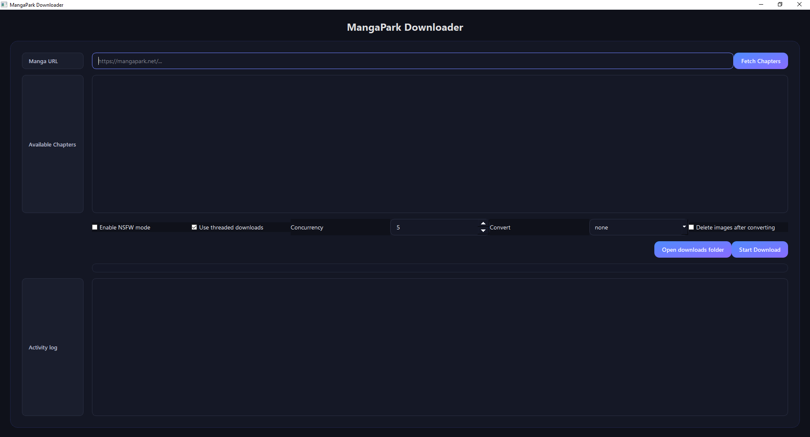

#  MangaPark Downloader

<p align="center">
  
</p>

<p align="center">
    A sleek and powerful Python application for downloading manga from <a href="https://mangapark.net">MangaPark</a>.
    <br />
    Features a modern graphical interface, multi-threaded downloads, and automatic conversion to CBZ and PDF formats.
</p>

## ✨ Features

-   **Modern GUI**: A user-friendly interface built with PyQt6 for a seamless experience.
-   **Concurrent Downloads**: Utilizes multi-threading to download chapters faster.
-   **Smart Image Filtering**: Intelligently skips icons and small, irrelevant images.
-   **Format Conversion**: Automatically converts chapters into `.cbz` or `.pdf` files.
-   **Flexible Selection**: Download single chapters, a range, or all chapters of a manga.
-   **Command-Line Interface**: Also supports a full-featured CLI for terminal lovers.

## 🚀 Getting Started

### Prerequisites

-   Python 3.7+
-   Google Chrome
-   [ChromeDriver](https://chromedriver.chromium.org/downloads) (must match your Chrome version and be in your system's PATH).

### Installation

1.  **Clone the repository:**
    ```bash
    git clone https://github.com/your-username/mangapark-downloader.git
    cd mangapark-downloader
    ```

2.  **Install dependencies:**
    ```bash
    pip install -r requirements.txt
    ```

### Running the Application

To launch the graphical interface, run:

```bash
python -m gui.app
```

Alternatively, you can use the command-line version:

```bash
python mangapark.py
```

## ⚙️ Usage

1.  **Launch the app** and paste a MangaPark URL into the input field.
2.  Click **"Fetch Chapters"** to load the available chapters.
3.  **Select** the chapters you wish to download from the list.
4.  Configure **download options**:
    -   Enable/disable threaded downloads.
    -   Set the number of concurrent workers.
    -   Choose a conversion format (`none`, `cbz`, `pdf`, `both`).
    -   Opt to delete the source images after conversion.
5.  Click **"Start Download"** and monitor the progress in the activity log.

## 📜 License

This project is licensed under the MIT License - see the [LICENSE](LICENSE) file for details.
